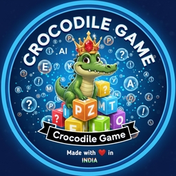
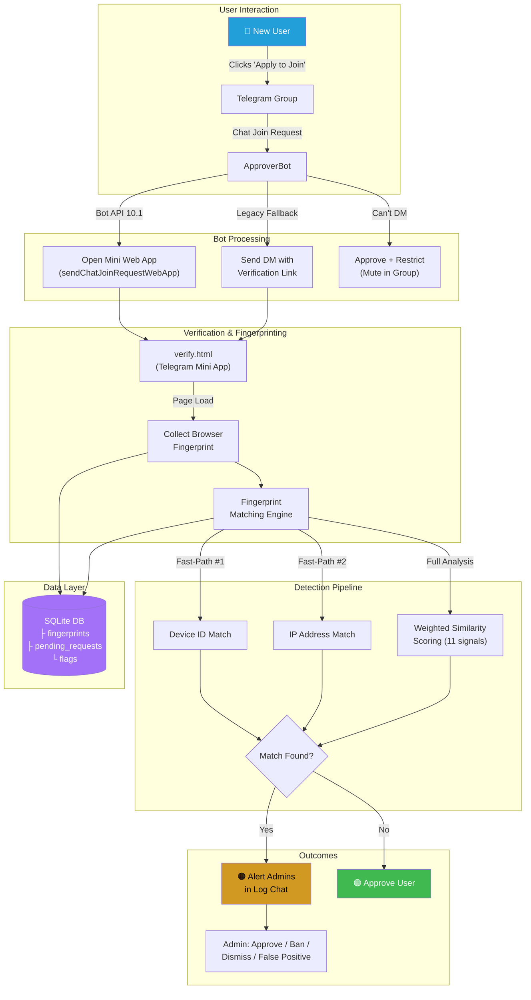
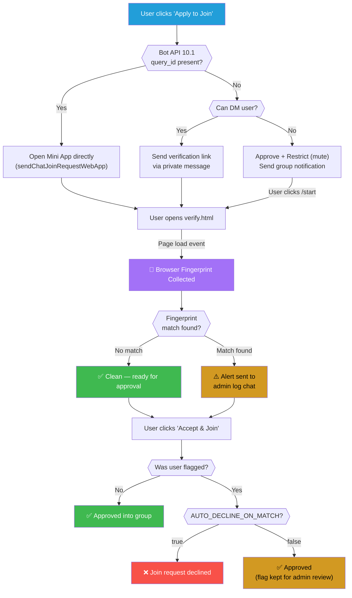
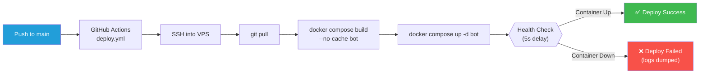

<p align="center">
  
</p>

<h1 align="center">Approver Bot</h1>

<p align="center">
  <b>Telegram Join Request Verification &amp; Multi-Account Detection Bot</b>
</p>

<p align="center">
  
  
  
  
  
  <a href="https://github.com/harshjais369/ApproverBot/actions/workflows/deploy.yml">
    
  </a>
</p>

<p align="center">
  A production-grade Telegram bot that gates group access behind a browser-based verification step,<br/>
  fingerprints every incoming user, and detects multi-account abuse in real time.
</p>

---

## Table of Contents

- [Overview](#overview)
- [Key Features](#key-features)
- [System Architecture](#system-architecture)
- [Verification Flow](#verification-flow)
- [Fingerprint Detection Engine](#fingerprint-detection-engine)
- [Project Structure](#project-structure)
- [Prerequisites](#prerequisites)
- [Quick Start (Local Development)](#quick-start-local-development)
- [Configuration Reference](#configuration-reference)
- [Production Deployment (Docker)](#production-deployment-docker)
- [Admin Commands](#admin-commands)
- [API Reference](#api-reference)
- [Database Schema](#database-schema)
- [Backup & Restore](#backup--restore)
- [CI/CD Pipeline](#cicd-pipeline)
- [Security Considerations](#security-considerations)
- [Troubleshooting](#troubleshooting)
- [Contributing](#contributing)

---

## Overview

**Approver Bot** is the anti-abuse gatekeeper for the [Crocodile Games](https://t.me/CrocodileGames) Telegram community. When a user requests to join a protected group, the bot intercepts the request, serves a Telegram Mini Web App for verification, silently collects a browser fingerprint, and cross-references it against all known users to detect multi-account abuse — all before the user even clicks "Accept & Join".

Built for **Bot API 10.1** (June 2026), it supports the new `sendChatJoinRequestWebApp` flow alongside a robust legacy DM fallback for maximum compatibility.

---

## Key Features

| Feature | Description |
|:--------|:------------|
| 🔐 **Mini Web App Verification** | Serves a branded Terms & Conditions page inside Telegram's native Mini App frame |
| 🧬 **Browser Fingerprinting** | Collects 15+ signals: canvas hash, WebGL hash, audio hash, fonts, device memory, screen resolution, user agent, and more |
| ⚡ **Fast-Path Detection** | Instant flagging via `device_id` (same Telegram app) or `ip_address` (same network) matches |
| 📊 **Weighted Similarity Scoring** | 11-component weighted algorithm with configurable thresholds (default 75%) |
| 🔗 **Transitive Cluster Detection** | Discovers multi-account clusters via recursive graph traversal (A↔B, B↔C → {A,B,C}) |
| 🌐 **IP Geolocation Enrichment** | Enriches fingerprints with ISP, location, and mobile-network data via ip-api.com |
| 🛡️ **Bot API 10.1 Support** | Native `sendChatJoinRequestWebApp` + `answerChatJoinRequestQuery` via official TeleBot support (requires an up-to-date pyTelegramBotAPI release that includes Bot API 10.1 join-request query APIs) |
| 📩 **Admin Notification System** | Real-time alerts in a log chat with approve/ban/dismiss/false-positive inline buttons |
| 🐳 **Production Docker Stack** | Nginx + Let's Encrypt + Flask + Bot in a hardened Docker Compose setup |
| 🚀 **CI/CD via GitHub Actions** | Push-to-deploy pipeline with SSH and health checks |

---

## System Architecture

```
┌─────────────────────────────────────────────────────────────────────────────┐
│                              INTERNET                                       │
│                                                                             │
│   Telegram User ──▶ Join Request ──▶ Telegram Bot API ──▶ Bot (polling)     │
│                                                                             │
│   User Browser ──▶ HTTPS ──▶ Nginx (:443) ──▶ Flask (:5000) ──▶ SQLite     │
└─────────────────────────────────────────────────────────────────────────────┘
```



---

## Verification Flow

The bot handles three distinct scenarios when a user requests to join:



---

## Fingerprint Detection Engine

The engine uses a **three-tier detection strategy** to maximize accuracy while minimizing latency:

### Tier 1 — Fast-Path Checks (Instant)
| Signal | Rationale | Result |
|:-------|:----------|:-------|
| `device_id` | Same Telegram app (localStorage UUID) across different accounts | **Instant flag** (100% confidence) |
| `ip_address` | Same network = same physical user | **Instant flag** (100% confidence) |

### Tier 2 — Weighted Similarity Scoring
If no fast-path match is found, a full weighted comparison runs against all stored fingerprints:

| Component | Weight | Comparison |
|:----------|-------:|:-----------|
| `canvas_hash` | 19% | Exact match |
| `fonts_hash` | 19% | Exact match |
| `user_agent` | 17% | Exact match |
| `audio_hash` | 15% | Exact match |
| `webgl_hash` | 7% | Exact match |
| `ip_info` (ISP + geo) | 5% | JSON object match |
| `hardware` (CPU + RAM) | 5% | Combined exact match |
| `screen_resolution` | 5% | Exact match |
| `platform` | 4% | Exact match |
| `timezone` | 3% | Exact match |
| `languages` | 1% | Jaccard overlap ≥ 80% |

A normalized similarity score ≥ `SIMILARITY_THRESHOLD` (default **75%**) triggers a flag.

### Tier 3 — Transitive Cluster Discovery
Once two users are linked, the system uses **recursive CTE queries** to discover the full connected component:

```
If A ↔ B and B ↔ C are flagged → Cluster {A, B, C} is identified
```

Admins can view full clusters with the `/multis` command.

---

## Project Structure

```
ApproverBot/
├── .github/
│   └── workflows/
│       └── deploy.yml          # CI/CD: push-to-deploy via SSH
├── nginx/
│   ├── nginx.conf              # Production Nginx config (HTTPS + rate limiting)
│   └── nginx-init.conf         # Bootstrap config for Let's Encrypt challenge
├── static/
│   ├── branding/
│   │   └── crocodile-game-logo.jpg
│   ├── CrocBot_Usage_Guide.md  # Public docs served at /CrocBot_Usage_Guide.md
│   ├── robots.txt
│   └── telegram-web-app-shim.js # Fallback for Telegram WebApp SDK
├── templates/
│   ├── verify.html             # Mini Web App: T&C + fingerprint collector (793 lines)
│   └── group_terms.html        # Standalone terms page
├── bot.py                      # Main entry point: Telegram handlers + Flask routes
├── config.py                   # Environment-based configuration
├── database.py                 # SQLite data layer (WAL mode, indexed)
├── fingerprint.py              # Fingerprint comparison engine
├── validation.py               # Telegram initData HMAC-SHA256 validation
├── requirements.txt            # Python dependencies
├── Dockerfile                  # Multi-stage production image (non-root user)
├── docker-compose.yml          # Full stack: bot + nginx + certbot
├── deploy.sh                   # Deployment script (init + update)
├── backup-db.sh                # SQLite hot-backup script
├── .env.example                # Template for environment variables
├── .gitignore
└── .dockerignore
```

---

## Prerequisites

- **Python** 3.12+
- **Docker** & **Docker Compose** (for production)
- A **Telegram Bot** token (from [@BotFather](https://t.me/BotFather))
- A **domain name** with DNS pointing to your server (for HTTPS / Mini Web Apps)
- The bot must be an **admin** in the target group with "Approve new members" permission

---

## Quick Start (Local Development)

```bash
# 1. Clone the repository
git clone https://github.com/harshjais369/ApproverBot.git
cd ApproverBot

# 2. Create a virtual environment
python -m venv .venv
source .venv/bin/activate    # Linux/macOS
.venv\Scripts\activate       # Windows

# 3. Install dependencies
pip install -r requirements.txt

# 4. Configure environment
cp .env.example .env
# Edit .env with your values (see Configuration Reference below)

# 5. Run the bot
python bot.py
```

> **Note:** For local development, you'll need an HTTPS tunnel (e.g., [ngrok](https://ngrok.com/)) for the Mini Web App to work, since Telegram requires HTTPS for WebApp URLs.

---

## Configuration Reference

All settings are loaded from environment variables (`.env` file):

### Telegram Settings

| Variable | Required | Default | Description |
|:---------|:--------:|:--------|:------------|
| `BOT_TOKEN` | ✅ | — | Telegram bot token from @BotFather |
| `LOG_CHAT_ID` | ✅ | `0` | Chat ID where multi-account alerts are sent |
| `LOG_THREAD_ID` | ❌ | `0` | Forum topic/thread ID within the log chat (0 = no thread) |
| `SUPERUSERS` | ✅ | — | Comma-separated list of admin user IDs |
| `ALLOWED_GROUPS` | ❌ | — | Comma-separated group IDs to monitor (empty = all groups) |

### Web Server

| Variable | Required | Default | Description |
|:---------|:--------:|:--------|:------------|
| `WEB_BASE_URL` | ✅ | — | Public HTTPS URL (e.g. `https://crocodile.games`) |
| `WEB_HOST` | ❌ | `0.0.0.0` | Flask bind address |
| `WEB_PORT` | ❌ | `8443` | Flask port (overridden to `5000` in Docker) |

### Database

| Variable | Required | Default | Description |
|:---------|:--------:|:--------|:------------|
| `DB_PATH` | ❌ | `approverbot.db` | SQLite database file path |

### Fingerprint Matching

| Variable | Required | Default | Description |
|:---------|:--------:|:--------|:------------|
| `SIMILARITY_THRESHOLD` | ❌ | `0.75` | Minimum score to flag a match (0.0–1.0) |
| `DEVICE_ID_AUTO_FLAG` | ❌ | `true` | Auto-flag on device_id match |
| `AUTO_DECLINE_ON_MATCH` | ❌ | `false` | Auto-decline flagged users (vs. approve + alert) |
| `PENDING_REQUEST_TTL_MINUTES` | ❌ | `30` | Token expiry time for pending verifications |

### Component Weights

Fine-tune the weighted scoring algorithm (must sum to 1.0):

| Variable | Default | Signal |
|:---------|--------:|:-------|
| `WEIGHT_CANVAS_HASH` | `0.19` | HTML5 Canvas rendering fingerprint |
| `WEIGHT_FONTS` | `0.19` | Installed fonts hash |
| `WEIGHT_USER_AGENT` | `0.17` | Browser user-agent string |
| `WEIGHT_AUDIO_HASH` | `0.15` | AudioContext fingerprint |
| `WEIGHT_WEBGL_HASH` | `0.07` | WebGL renderer fingerprint |
| `WEIGHT_IP_INFO` | `0.05` | ISP + geolocation match |
| `WEIGHT_HARDWARE` | `0.05` | CPU cores + device memory |
| `WEIGHT_SCREEN` | `0.05` | Screen resolution |
| `WEIGHT_PLATFORM` | `0.04` | OS platform string |
| `WEIGHT_TIMEZONE` | `0.03` | Timezone identifier |
| `WEIGHT_LANGUAGES` | `0.01` | Browser language preferences |

---

## Production Deployment (Docker)

The production stack runs three containers orchestrated by Docker Compose:

```
┌────────────────────────────────────────────────────┐
│                Docker Compose Stack                 │
│                                                     │
│  ┌─────────────┐  ┌──────────┐  ┌──────────────┐  │
│  │   Nginx     │  │   Bot    │  │   Certbot    │  │
│  │  :80/:443   │──│  :5000   │  │  (renewal)   │  │
│  │  TLS + Rate │  │  Flask + │  │  Let's       │  │
│  │  Limiting   │  │  Telegram│  │  Encrypt     │  │
│  └─────────────┘  └──────────┘  └──────────────┘  │
│         │              │                            │
│         ▼              ▼                            │
│    certbot_conf    db_data                          │
│    certbot_www     (SQLite)                         │
└────────────────────────────────────────────────────┘
```

### First-Time Setup

```bash
# 1. SSH into your VPS
ssh user@your-server

# 2. Clone the repository
git clone https://github.com/harshjais369/ApproverBot.git
cd ApproverBot

# 3. Create your .env file
cp .env.example .env
nano .env  # Fill in all required values

# 4. Run the init script (obtains SSL certificate)
chmod +x deploy.sh
./deploy.sh init yourdomain.com admin@yourdomain.com
```

This will:
1. Replace `YOUR_DOMAIN` placeholders in Nginx configs
2. Start Nginx with HTTP-only config for ACME challenge
3. Obtain SSL certificate from Let's Encrypt
4. Restore full HTTPS Nginx config
5. Start all services

### Updating

```bash
./deploy.sh update
# Or simply push to main — GitHub Actions handles the rest
```

---

## Admin Commands

All commands are restricted to `SUPERUSERS` only:

| Command | Usage | Description |
|:--------|:------|:------------|
| `/start` | `/start` | (Any user) Shows welcome message; sends pending verification links to restricted users |
| `/multis` | `/multis` | Display all detected multi-account clusters with account counts |
| `/connections` | `/connections <user_id>` or reply | Show all linked accounts and detection history for a specific user |
| `/links` | Alias for `/connections` | Same as `/connections` |
| `/conns` | Alias for `/connections` | Same as `/connections` |

### Inline Admin Actions

When a multi-account alert is sent to the log chat, admins get interactive buttons:

| Button | Action |
|:-------|:-------|
| ✅ **Approve User** | Approve the flagged user into the group |
| **Dismiss** | Remove the alert buttons (no action taken) |
| **Ban New User** | Ban the new (flagged) user from the group |
| **Ban Both** | Ban both the new user and the matched existing user |
| **False Positive** | Mark the flag as a false positive (excluded from future cluster detection) |

---

## API Reference

### `POST /api/verify`

Main verification endpoint called by the Mini Web App.

**Request Body:**
```json
{
  "initData": "<Telegram WebApp initData string>",
  "token": "<verification token>",
  "action": "load" | "accept",
  "fingerprint": {
    "deviceId": "uuid-v4",
    "canvasHash": "...",
    "webglHash": "...",
    "audioHash": "...",
    "screenResolution": "1920x1080",
    "platform": "Win32",
    "languages": ["en-US", "en"],
    "timezone": "Asia/Kolkata",
    "timezoneOffset": -330,
    "touchPoints": 0,
    "deviceMemory": 8,
    "hardwareConcurrency": 8,
    "fontsHash": "..."
  }
}
```

**Actions:**
- `load` — Collects fingerprint on page open, runs matching. Returns `clean`, `flagged`, or `linked`.
- `accept` — User clicked "Accept & Join". Approves or declines based on flag status.

**Response:**
```json
{
  "ok": true,
  "status": "clean" | "flagged" | "approved" | "linked"
}
```

### `GET /verify?token=<token>`

Serves the Mini Web App HTML page for user verification.

### `GET /terms` | `/tnc` | `/rules`

Serves the group Terms & Conditions page.

### `GET /`

Redirects to the bot's Telegram deep link.

### `GET /support`

Redirects to the support group.

---

## Database Schema

The bot uses **SQLite** with **WAL mode** for concurrent read performance:

### `pending_requests`
Tracks verification state for each join request.

| Column | Type | Description |
|:-------|:-----|:------------|
| `id` | INTEGER PK | Auto-increment ID |
| `status` | TEXT | `pending` / `restricted` / `completed` / `expired` |
| `chat_id` | INTEGER | Telegram group ID |
| `user_id` | INTEGER | Telegram user ID |
| `user_name` | TEXT | User's full name |
| `token` | TEXT UNIQUE | Verification token (UUID hex) |
| `created_at` | TEXT | ISO timestamp |
| `expires_at` | TEXT | Token expiry timestamp |

### `fingerprints`
Stores browser fingerprint data (one row per user, upserted on each verification).

| Column | Type | Description |
|:-------|:-----|:------------|
| `id` | INTEGER PK | Auto-increment ID |
| `user_id` | INTEGER | Telegram user ID |
| `device_id` | TEXT | localStorage UUID |
| `canvas_hash` | TEXT | Canvas rendering hash |
| `webgl_hash` | TEXT | WebGL renderer hash |
| `audio_hash` | TEXT | AudioContext hash |
| `ip_address` | TEXT | Client IP |
| `screen_resolution` | TEXT | e.g. `1920x1080` |
| `user_agent` | TEXT | Browser UA string |
| `platform` | TEXT | OS platform |
| `languages` | TEXT (JSON) | Browser languages array |
| `timezone` | TEXT | IANA timezone |
| `fonts_hash` | TEXT | Installed fonts hash |
| `ip_info` | TEXT (JSON) | `{isp, location, mobile}` |
| `raw_data` | TEXT (JSON) | Full fingerprint payload |
| `created_at` / `updated_at` | TEXT | Timestamps |

### `flags`
Records every multi-account detection event.

| Column | Type | Description |
|:-------|:-----|:------------|
| `id` | INTEGER PK | Auto-increment ID |
| `new_user_id` | INTEGER | The incoming user |
| `matched_user_id` | INTEGER | The existing user they matched |
| `similarity_score` | REAL | 0.0 – 1.0 similarity score |
| `matching_components` | TEXT (JSON) | List of matched signal names |
| `action_taken` | TEXT | `pending` / `flagged` / `approved` / `declined` / `false_positive` |
| `chat_id` | INTEGER | Group where the match occurred |
| `log_message_id` | INTEGER | Telegram message ID of the admin alert |
| `created_at` | TEXT | ISO timestamp |

---

## Backup & Restore

### Automated Backup

```bash
# Run the hot-backup script (safe for live databases)
./backup-db.sh
```

This performs a **SQLite online backup** inside the running container, copies it to the host, and retains the last 7 days of backups.

### Manual Backup

```bash
# Copy the live database from the Docker volume
docker cp approverbot-bot-1:/app/data/approverbot.db ./backup.db
```

### Scheduled Backups (cron)

```bash
# Add to crontab: daily backup at 3 AM
0 3 * * * cd /path/to/ApproverBot && ./backup-db.sh >> /var/log/approverbot-backup.log 2>&1
```

---

## CI/CD Pipeline

The project uses **GitHub Actions** for automated deployments:



**Required GitHub Secrets:**
| Secret | Description |
|:-------|:------------|
| `SSH_HOST` | VPS hostname or IP |
| `SSH_PORT` | SSH port |
| `SSH_USER` | SSH username |
| `SSH_PRIVATE_KEY` | Private key for passwordless SSH |

---

## Security Considerations

| Layer | Implementation |
|:------|:---------------|
| **HMAC Validation** | All Mini Web App `initData` is verified using HMAC-SHA256 with the bot token as secret key |
| **Rate Limiting** | Nginx limits `/api/verify` to 5 requests/minute per IP with burst=3 |
| **HTTPS Enforcement** | HTTP → HTTPS redirect; HSTS with `max-age=63072000` (2 years) |
| **CSP Headers** | Strict Content-Security-Policy whitelisting Telegram origins only |
| **Non-Root Container** | Docker image runs as `botuser:botgroup`, not root |
| **No Secrets in Image** | `.env` files are excluded from the Docker image via `.dockerignore` |
| **Request Size Limit** | Nginx caps POST body at 64KB for fingerprint submissions |
| **Token Expiry** | Verification tokens auto-expire after `PENDING_REQUEST_TTL_MINUTES` (default 30) |
| **WAL Mode** | SQLite runs in Write-Ahead Logging mode for concurrent read safety |
| **Unauthorized Join Protection** | Users who bypass the join flow are immediately kicked via `chat_member` handler |

---

## Troubleshooting

| Problem | Solution |
|:--------|:---------|
| Bot can't DM users | Ensure users have started the bot. The fallback "approve + restrict" flow handles this automatically |
| Mini Web App not loading | Verify `WEB_BASE_URL` uses HTTPS and the domain has a valid SSL certificate |
| Fingerprints not matching | Check `SIMILARITY_THRESHOLD` — lowering it catches more matches but may increase false positives |
| `sendChatJoinRequestWebApp` fails | This requires Bot API 10.1. The bot falls back to the DM flow automatically |
| Database locked errors | SQLite WAL mode should prevent this. Ensure only one bot instance writes to the DB |
| Nginx 502 errors | Check that the bot container is running: `docker compose logs bot` |
| SSL certificate expired | Certbot auto-renews every 12h. Force renewal: `docker compose run --rm certbot renew --force-renewal` |

---

## Contributing

See [CONTRIBUTING.md](CONTRIBUTING.md) for guidelines on how to contribute.

---

## Community & Legal

| Document | Purpose |
|:---------|:--------|
| [LICENSE](LICENSE) | All Rights Reserved — proprietary software |
| [SECURITY.md](SECURITY.md) | Vulnerability reporting policy |
| [CONTRIBUTING.md](CONTRIBUTING.md) | Contribution guidelines and code style |
| [CODE_OF_CONDUCT.md](CODE_OF_CONDUCT.md) | Community behavior standards |
| [CHANGELOG.md](CHANGELOG.md) | Version history and notable changes |

---

<p align="center">
  Built with 🐊 by <a href="https://t.me/exceptionl">Exception</a> for <a href="https://t.me/CrocodileGames">Crocodile Games</a>
</p>
